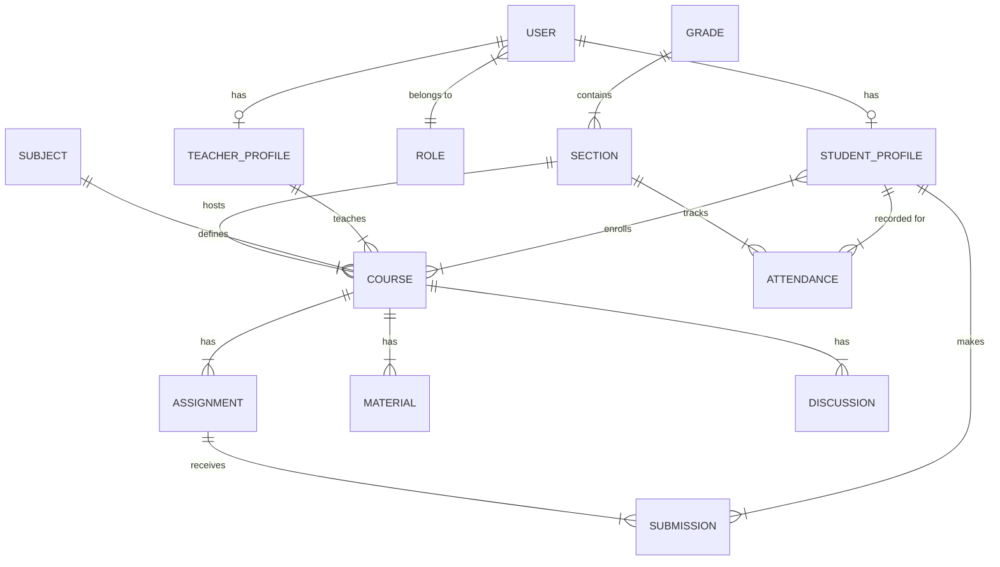

# School Learning Management System (LMS)
## Product Architecture, UX/UI & User-Flow Design Specification

---

## A. Product Overview

The School Learning Management System (LMS) is a centralized, digital academic platform designed to support the complete educational workflow for teachers, students, administrators, and parents. 

**Product Philosophy:**
The core philosophy of this LMS is a **Grade-Aware Access Model**. Recognizing that a 1st grader and a 10th grader have fundamentally different cognitive abilities and technical needs, the system dynamically scales its complexity:
- **Early Years (KG–Grade 4):** A teacher-centric model focused on rapid administrative tasks (attendance, basic records). No direct student access.
- **Middle Years (Grades 5–7):** A guided, simplified student dashboard introducing digital literacy, task management, and assignment submission.
- **High School (Grades 8–10):** A comprehensive academic hub fostering independence, featuring advanced scheduling, GPA tracking, and moderated discussion forums.

Security, Role-Based Access Control (RBAC), and data isolation are foundational, ensuring users only interact with authorized data.

---

## B. Role & Permission Matrix

| Feature / Module | Super Admin | School Admin | Teacher | Student | Parent/Guardian (Future) |
| :--- | :---: | :---: | :---: | :---: | :---: |
| **System Settings & Config** | ✅ | ✅ (Scoped) | ❌ | ❌ | ❌ |
| **Manage Users & Roles** | ✅ | ✅ | ❌ | ❌ | ❌ |
| **Course & Subject Setup** | ✅ | ✅ | ❌ | ❌ | ❌ |
| **Manage Enrollments** | ✅ | ✅ | ❌ | ❌ | ❌ |
| **Take Attendance** | ✅ | ✅ | ✅ (Own classes) | ❌ | ❌ |
| **Create/Grade Assignments** | ✅ | ✅ | ✅ (Own courses) | ❌ | ❌ |
| **Submit Assignments** | ❌ | ❌ | ❌ | ✅ (Own assignments)| ❌ |
| **View Course Materials** | ✅ | ✅ | ✅ (Own courses) | ✅ (Enrolled) | ✅ (Linked child) |
| **Moderate Discussions** | ✅ | ✅ | ✅ (Own courses) | ❌ | ❌ |
| **Participate in Discussions** | ❌ | ❌ | ✅ | ✅ (Authorized) | ❌ |
| **View Student Grades/GPA** | ✅ | ✅ | ✅ (Own students) | ✅ (Own grades) | ✅ (Linked child) |
| **Messaging** | ✅ | ✅ | ✅ | ✅ (Restricted) | ✅ (Restricted) |
| **Generate Reports** | ✅ | ✅ | ✅ (Own classes) | ❌ | ❌ |

---

## C. Grade-Based Feature Matrix

| Feature Category | Early Years (KG–4) | Middle Years (Grades 5–7) | High School (Grades 8–10) |
| :--- | :--- | :--- | :--- |
| **Primary User** | Teacher / Admin | Student / Teacher | Student / Teacher |
| **Student Login** | ❌ No Access | ✅ Guided Access | ✅ Full Access |
| **Dashboard Style** | Teacher Ops Focus | Simple, Task-Oriented | Advanced, Academic Overview |
| **Attendance** | Teacher-managed | View-only summary | View-only detailed |
| **Assignments** | Offline/Teacher managed | Simple digital submission | Advanced (Rubrics, revisions) |
| **Course Materials** | Teacher resource hub | Basic downloads | Comprehensive Hub (Multi-format) |
| **Grades & Progress** | Basic record keeping | Simple grades / feedback | Advanced Gradebook, GPA |
| **Calendar** | Teacher planning | Simple due dates | Advanced (Monthly/Weekly, Events) |
| **Messaging** | Parent-Teacher (Optional) | Restricted Teacher-Student | Teacher-Student, Announcements |
| **Discussions** | ❌ None | ❌ None | ✅ Moderated Academic Forums |

---

## D. Information Architecture

### Teacher Navigation
- **Dashboard:** Schedule today, alerts, quick actions.
- **Classes:** 
  - [Class List] -> Roster, Attendance, Basic Records.
- **Courses (Grades 5-10):**
  - [Course List] -> Syllabus, Materials, Assignments, Gradebook, Discussions.
- **Messages:** Inbox, Sent.
- **Reports:** Attendance summaries, Grade distributions.

### Student Navigation (Grades 5-7)
- **Dashboard:** Today's Tasks, Alerts, Recent Grades.
- **My Courses:**
  - [Course List] -> Materials, Assignments (Due/Submitted), Grades.
- **Messages:** Teacher communication.

### Student Navigation (Grades 8-10)
- **Dashboard:** GPA, Schedule, Upcoming Deadlines.
- **My Courses:**
  - [Course List] -> Syllabus, Materials, Assignments, Discussions, Detailed Gradebook.
- **Calendar:** Unified view of all courses and school events.
- **Messages:** Teacher communication.
- **Academic Progress:** Historical grades, transcripts.

---

## E. Database Schema

*Assumption: UUIDs are used for primary keys to ensure global uniqueness and security against enumeration.*

### Key Entities:
1. **Users:** Base table for authentication. `(id, email, password_hash, role_id, is_active)`
2. **Roles & Permissions:** RBAC implementation.
3. **Profiles (Students/Teachers):** Linked to Users. `(user_id, first_name, last_name, dob, grade_level_id)`
4. **AcademicStructure:** 
   - `AcademicYears (id, name, start_date, end_date)`
   - `Grades (id, name, level_group)` e.g., Grade 1, High School.
   - `Sections (id, grade_id, name)` e.g., Grade 4-A.
   - `Subjects (id, name, code)`
5. **Courses:** Instance of a subject in a specific term/section. `(id, subject_id, section_id, teacher_id, year_id)`
6. **Enrollments:** Maps students to courses/sections. `(student_id, course_id)`
7. **Attendance:** `(id, section_id, student_id, date, status [Present/Absent/Late], teacher_id)`
8. **Assignments:** `(id, course_id, title, description, due_date, max_score)`
9. **Submissions:** `(id, assignment_id, student_id, status, submitted_at, grade, feedback)`
10. **Materials:** `(id, course_id, title, file_url, type, visibility)`
11. **Discussions:** `(id, course_id, title, author_id)` -> `DiscussionReplies`

### High-Level ERD

---

## F. User Flows

### 1. KG–Grade 4 Teacher Attendance
- **Trigger:** Teacher opens LMS in the morning.
- **Screen:** Teacher Dashboard.
- **Action:** Clicks "Take Attendance" quick action.
- **Screen:** Attendance Module (defaults to current date and primary assigned section).
- **UI:** List of students with toggle buttons (P/A/L/E). All default to 'Present'.
- **Action:** Teacher taps 'Absent' for two missing students. Clicks "Save".
- **Validation:** Ensures date is valid and teacher is authorized for the section.
- **Success State:** Toast notification "Attendance saved successfully". Screen returns to Dashboard.

### 2. Grade 8 Student Assignment Submission
- **Trigger:** Student needs to submit a math worksheet.
- **Screen:** Student Dashboard -> Clicks "Pending: Algebra Worksheet".
- **Screen:** Assignment Details (Shows instructions, due date, rubric).
- **Action:** Clicks "Upload Submission".
- **UI:** File upload modal with drag-and-drop.
- **Action:** Selects PDF file. Uploads. Clicks "Submit Final".
- **Validation:** Checks file type/size limits. Checks against deadline.
- **Success State:** Status changes from *Draft* to *Submitted*. Timestamp recorded. Confetti micro-animation.

### 3. Teacher Creating an Assignment
- **Trigger:** Teacher wants to assign homework.
- **Screen:** Course Hub -> Assignments Tab -> "Create New".
- **UI:** Form (Title, Description, Attachments, Due Date, Max Score).
- **Action:** Fills form, attaches a PDF, selects visibility "Publish Now". Clicks "Save".
- **Backend:** Saves record, triggers notification to enrolled students.

### 4. Teacher Grading an Assignment
- **Screen:** Assignment Details -> Submissions List.
- **UI:** Table of students showing status (Submitted/Late/Missing).
- **Action:** Clicks a student's 'Submitted' row.
- **Screen:** Grading View (Split screen: File preview on left, grading panel on right).
- **Action:** Enters score (e.g., 85/100), types feedback. Clicks "Save & Return to Student".
- **Backend:** Updates submission status to *Graded*, triggers notification to student.

### 5. Student Accessing Course Materials
- **Screen:** Dashboard -> Clicks "Science 10" course card.
- **Screen:** Course Hub. Clicks "Materials" tab.
- **UI:** Folders grouped by Topic/Week.
- **Action:** Clicks "Week 1: Photosynthesis" -> Downloads attached PDF lecture notes.

---

## G. UX/UI Specification

### General Principles
- **Design System:** Tailwind CSS (or similar utility-first framework) for consistent spacing, typography, and color tokens.
- **Typography:** Modern sans-serif (e.g., Inter or Roboto). Clear hierarchy.
- **Color Palette:** Professional yet approachable. 
  - Primary: Deep Blue (Trust, Academic). 
  - Secondary/Accents: Vibrant colors for statuses (Green for success, Amber for pending, Red for late/errors).
- **Responsiveness:** Mobile-first approach for Student dashboards. Tablet-optimized for Teacher grading and attendance interfaces.

### Major UI Components
- **Global Sidebar/Header:** Context-aware navigation depending on active role.
- **Data Tables:** Sortable, filterable, with pagination. Used for gradebooks and administrative lists.
- **Cards:** Used for courses, assignments, and summary metrics on dashboards.
- **Modals:** For disruptive actions (confirming deletion, submitting assignments).
- **Status Badges:** Standardized pills indicating states (e.g., `<Badge color="green">Graded</Badge>`).

---

## H. Security Architecture

1. **Authentication:** 
   - JWT (JSON Web Tokens) or secure HTTP-only cookies.
   - Password hashing via Argon2 or bcrypt.
2. **Authorization (RBAC):** 
   - Middleware on the backend verifies `user.role` for global actions.
   - Resource-level checks: e.g., before allowing a teacher to grade an assignment, the API verifies `TeacherAssignment` joins `Course` joins `Assignment`.
3. **Data Isolation (Multi-tenant logic):**
   - A student API request (e.g., `/api/students/me/grades`) inherently scopes database queries to `WHERE student_id = current_user.id`. 
   - Students cannot pass a different ID in the URL; the backend relies on the token's identity.
4. **File Security:** 
   - Uploads stored in secure cloud storage (e.g., AWS S3).
   - URLs are non-guessable.
   - For sensitive materials, use Presigned URLs generated dynamically upon authorization check.
5. **Input Validation:** Strict server-side validation (e.g., Zod or Joi) to prevent SQL injection and XSS.
6. **Audit Logging:** Dedicated `AuditLogs` table tracking `user_id, action, resource_type, resource_id, timestamp, ip_address`.

---

## I. API Architecture

RESTful architecture with standard HTTP methods (GET, POST, PUT, PATCH, DELETE).

### Core Resource Groups:
- **`POST /api/auth/login`**: Authenticate and receive token.
- **`GET /api/users/me`**: Get current user profile and role.
- **`GET /api/courses`**: List courses (scoped to user's enrollment/teaching assignment).
- **`GET /api/courses/:id/materials`**: Get course files.
- **`POST /api/attendance`**: Bulk insert/update attendance records (Teacher/Admin only).
- **`POST /api/assignments/:id/submissions`**: Upload assignment file (Student only).
- **`PATCH /api/submissions/:id/grade`**: Grade an assignment (Teacher only).
- **`GET /api/reports/students/:id/progress`**: Get aggregated GPA/grades (Admin/Teacher/Self).

---

## J. Notification Architecture

**Infrastructure:** Event-driven architecture. When an action occurs (e.g., `GradeUpdatedEvent`), a worker processes it and dispatches notifications.

**Delivery Channels:** In-app notification bell (primary), Email (secondary, configurable).

**Triggers & Recipients:**
- *Assignment Created* -> Enrolled Students.
- *Deadline Approaching (24h)* -> Students who haven't submitted.
- *Assignment Graded* -> Specific Student.
- *New Course Material* -> Enrolled Students.
- *Discussion Flagged* -> Course Teacher / Admin.

---

## K. Reporting Architecture

**Admin Reports:**
- School-wide attendance trends.
- Teacher utilization and assignment frequency.
- Grade distribution across sections (identifying outliers).

**Teacher Reports:**
- Section-level attendance percentages.
- Assignment completion rates (identifying at-risk students).
- Item analysis (if quizzes are implemented).

**Implementation:** Complex analytical queries should run against read-replicas (if scaled) or be cached daily to prevent slowing down the transactional database.

---

## L. Recommended Technology Stack

*Assumption: Aiming for a modern, scalable, and maintainable cloud-native stack.*

- **Frontend:** **Next.js (React) + TypeScript.** Provides excellent developer experience, server-side rendering for performance, and strong typing for large codebases. Tailwind CSS for styling.
- **Backend/API:** **Node.js with NestJS (TypeScript)** OR **Python with FastAPI**. NestJS offers a robust, opinionated structure perfect for complex RBAC and enterprise patterns.
- **Database:** **PostgreSQL.** A powerful, open-source relational database perfectly suited for normalized academic data, transactions, and complex queries. Use Prisma or TypeORM.
- **File Storage:** **AWS S3** (or equivalent cloud blob storage) for assignment uploads and course materials.
- **Caching:** **Redis.** For session management, caching complex reports, and rate limiting.
- **Hosting/Deployment:** **Docker** containers orchestrated on AWS ECS/EKS or Vercel (for frontend) + Render/Heroku (for backend) for an easier MVP launch.

---

## M. MVP Roadmap

### Phase 1 — MVP (Target: Core Operations)
- User Authentication & RBAC implementation.
- Academic Structure setup (Years, Grades, Sections, Subjects).
- Teacher Attendance module (KG-4 priority).
- Basic Student Dashboard (Grades 5-10).
- Course Materials Hub (View/Download).
- Assignment Submission Engine (Basic file upload & status).
- Fundamental Security and Data Isolation.

### Phase 2 — Core LMS (Target: Academic Expansion)
- Gradebook and Rubrics.
- Advanced Calendar & Event system.
- Teacher-Student Messaging.
- Basic Reporting & Dashboards.
- Parent/Guardian Portal (View-only).
- In-app Notification System.

### Phase 3 — Advanced LMS (Target: Engagement & Scale)
- Moderated Discussion Forums.
- Online Quizzes and Auto-grading.
- Advanced Analytics and Predictive Reporting (at-risk students).
- Third-party integrations (e.g., Google Workspace, Zoom, Plagiarism checkers).
- Mobile Native Applications (iOS/Android).
